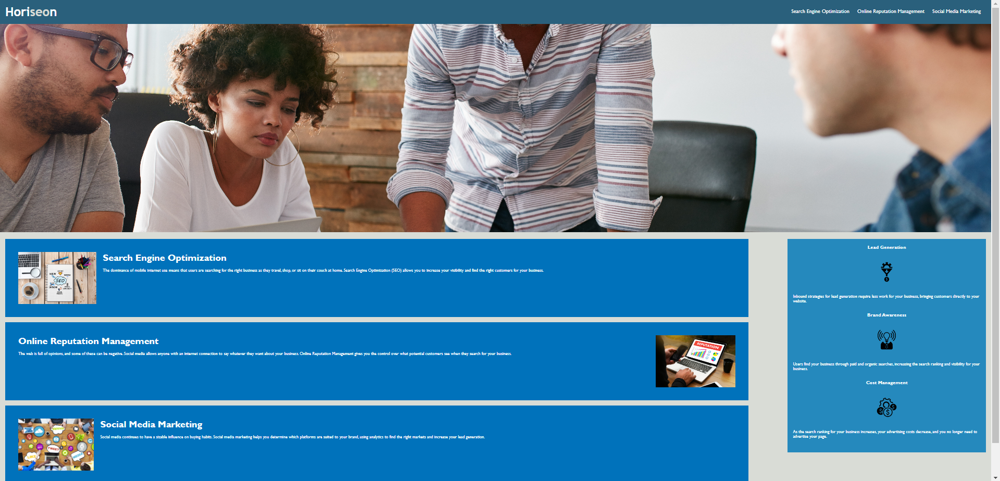

# 01 HTML, CSS, and Git: Code Refactor

## Description

This assignment is a code refactor for the Horiseon landing page. The purpose of this assignment was to prepare coders for scenarios that they will encounter as a web developer. This assignment required organizing and consolidating the html and css code in a semantic structure while still keeping the main functions of the landing page intact. 

## Tasks 

- CSS code was consilidated and labeled
- HTML was reoganized semantically and labeled by section
- Comments were added to html and css files
- alt text was added to the images and logos
- Title was added to the head
- broken links were fixed
- Refacted code and website was uploaded to the github repository

## Usage

## Credits

- https://www.w3schools.com/css/css_selectors.asp
- https://www.w3schools.com/html/html_intro.asp
- https://www.w3schools.com/html/html5_syntax.asp
- https://www.makeareadme.com/
- https://docs.github.com/en/get-started/writing-on-github/getting-started-with-writing-and-formatting-on-github/basic-writing-and-formatting-syntax#lists

## License

MIT License

Copyright (c) [2022] [Robert Ambriz]

Permission is hereby granted, free of charge, to any person obtaining a copy
of this software and associated documentation files (the "Software"), to deal
in the Software without restriction, including without limitation the rights
to use, copy, modify, merge, publish, distribute, sublicense, and/or sell
copies of the Software, and to permit persons to whom the Software is
furnished to do so, subject to the following conditions:

The above copyright notice and this permission notice shall be included in all
copies or substantial portions of the Software.

THE SOFTWARE IS PROVIDED "AS IS", WITHOUT WARRANTY OF ANY KIND, EXPRESS OR
IMPLIED, INCLUDING BUT NOT LIMITED TO THE WARRANTIES OF MERCHANTABILITY,
FITNESS FOR A PARTICULAR PURPOSE AND NONINFRINGEMENT. IN NO EVENT SHALL THE
AUTHORS OR COPYRIGHT HOLDERS BE LIABLE FOR ANY CLAIM, DAMAGES OR OTHER
LIABILITY, WHETHER IN AN ACTION OF CONTRACT, TORT OR OTHERWISE, ARISING FROM,
OUT OF OR IN CONNECTION WITH THE SOFTWARE OR THE USE OR OTHER DEALINGS IN THE
SOFTWARE.